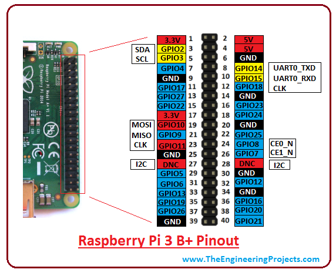
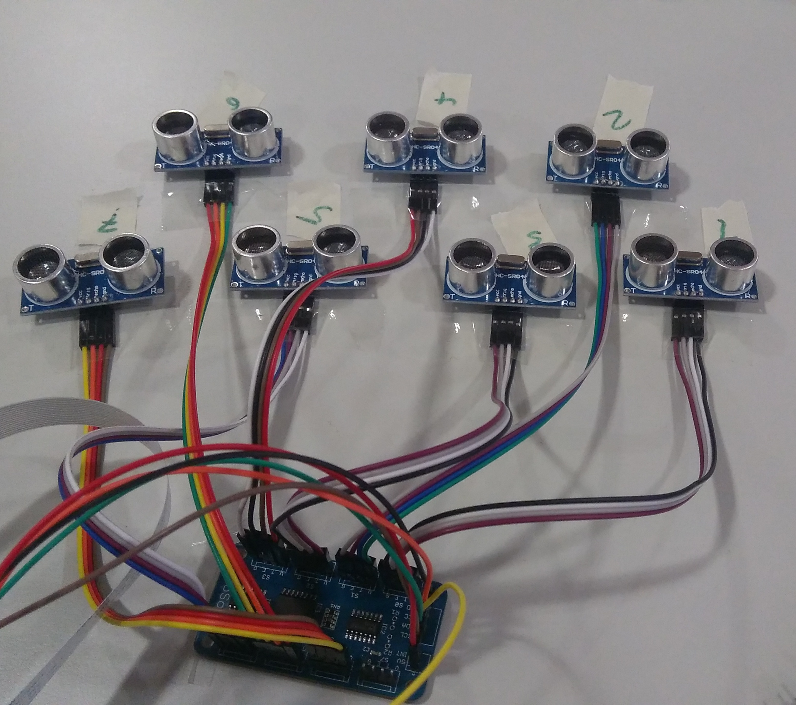

# Verkabelung

- [Octosonar](#octosonar)
- [Ultraschallsensoren](#ultraschallsensoren)
- [BrickPi3](#brickpi3)

## Octosonar

Board | Raspberry Pi
---|---
INT | PIN22
SDA | PIN3
SCL | PIN5
VCC | PIN1
5V | PIN2
GND | PIN6

## Ultraschallsensoren

Board | Sensor | Name
---|---|---
S0 | 1 | LEFT
S1 | 2 | LEFT45
S2 | 3 | LEFT_FRONT
S3 | 4 | RIGHT_FRONT
S4 | 5 | RIGHT45
S5 | 6 | RIGHT
S6 | 7 | BACK

## BrickPi3

Port | Motor | Kabellänge (je niedriger, desto kürzer)
---|---|---
A | Gabel hoch/runter | 3
B | Fahren | 1
C | Gabel kippen | 2
D | Lenkung | 4
